## Índice

* [Grafana](#grafana)
  * [Dashboard do node exporter no grafana](#dashboard-do-node-exporter-no-grafana)

## Introdução <a name="introducao"></a>

O objetivo desse projeto e juntar todo o estudo de devOps em containers docker. Os outros projetos de reposiório podem ser estudados separadamente. Um observação importante é que tudo está levando em consideração que o seu sistema operacional é o Ubuntu.

### Portas do network interno docker <a name="portas-do-network-interno-docker"></a>

As portas configuradas para as aplicações:

| APP | HTTP | HTTPS | OUTRO | DNS |
|---|---|---|---|---|
| Grafana | 3000 | X | X | [http://localhost:3000](http://localhost:3000) |


Para testar a porta:

```shell
telnet localhost 9043
```

## Obter o IP do proxy <a name="obter-o-ip-do-proxy"></a>

Comando para obter o `ip` de um container:

```shell
docker inspect prometheus-local -f '{{range .NetworkSettings.Networks}}{{.IPAddress}}{{end}}' $(docker ps --filter name=reverse -q)
```

## Grafana <a name="grafana"></a>

Temos um container com o `Grafana` para acessar a documetação: [https://grafana.com/docs/grafana/latest/setup-grafana/installation/docker/](https://grafana.com/docs/grafana/latest/setup-grafana/installation/docker/).

Para acessar primeiramente do grafana use:

- Login: admin
- Pass: admin

#### Dashboard do node exporter no grafana <a name="dashboard-do-node-exporter-no-grafana"></a>

O projeto com o Node exporter está em: [danielso2007/prometheus_docker](https://github.com/danielso2007/prometheus_docker).

Baixar no endereço: [rfrail3/grafana-dashboards](https://github.com/rfrail3/grafana-dashboards/tree/master/prometheus) ou use em `grafana/dashboard/node-exporter-full.json`.

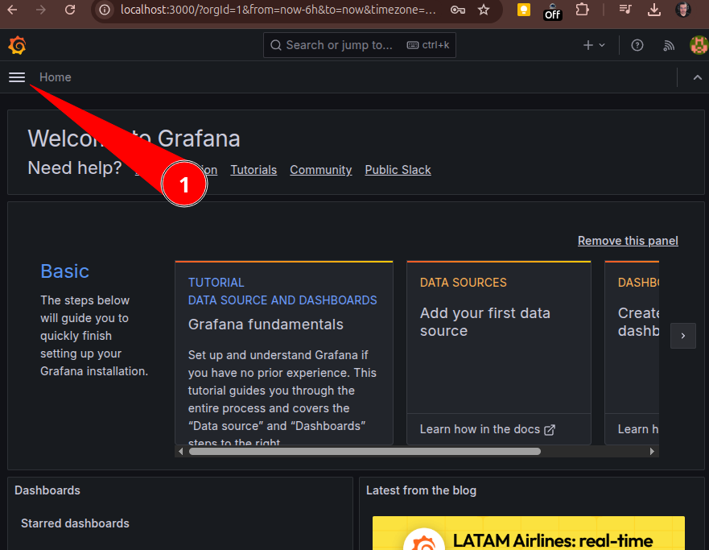


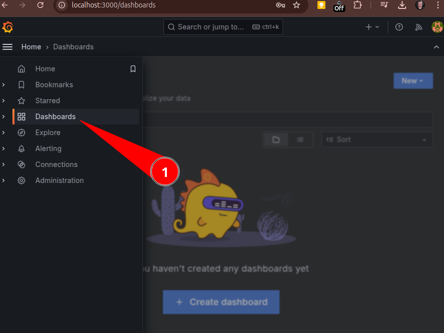


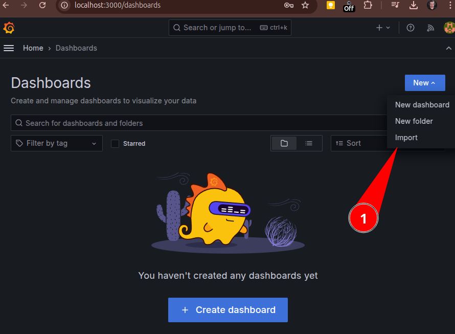


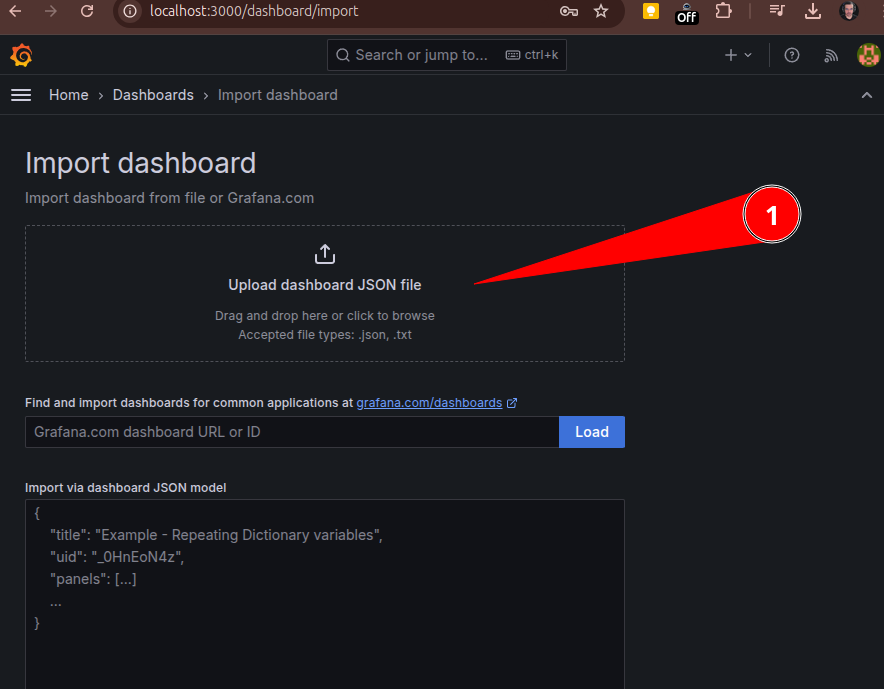


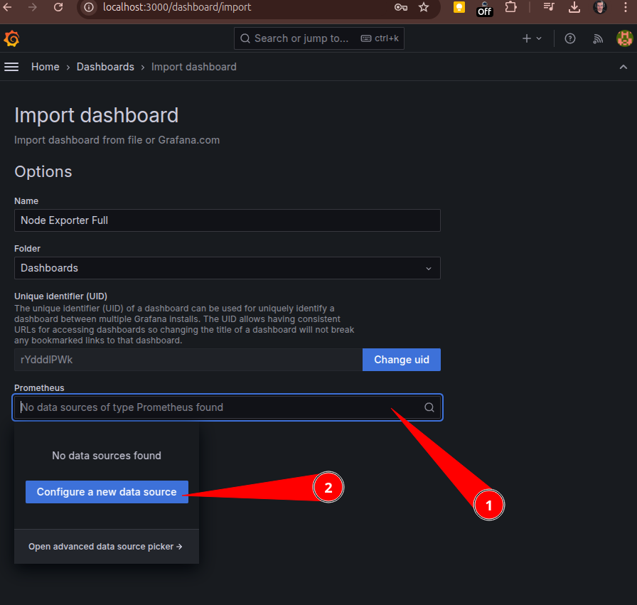


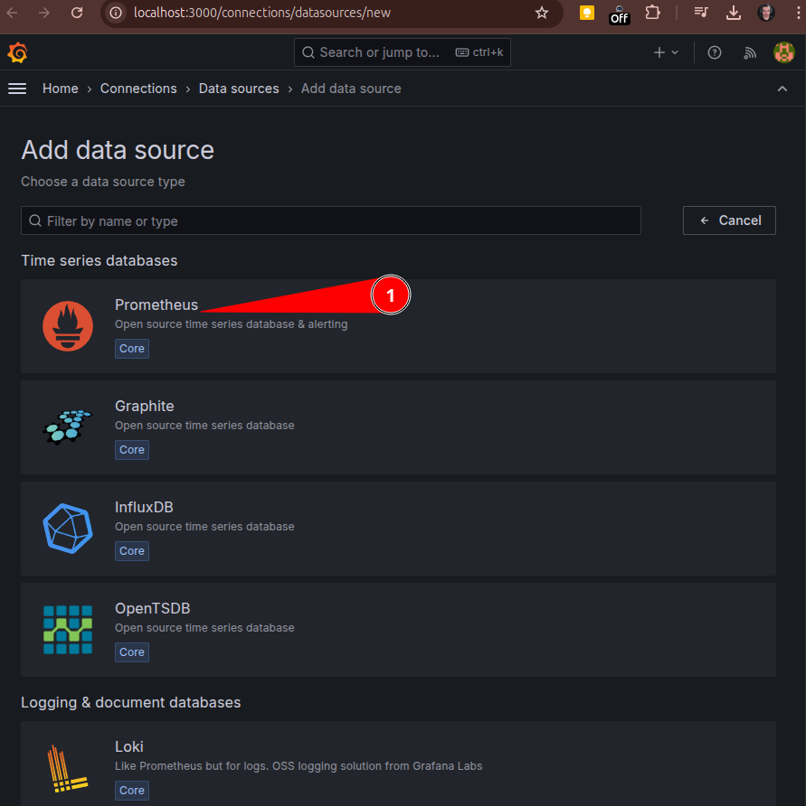

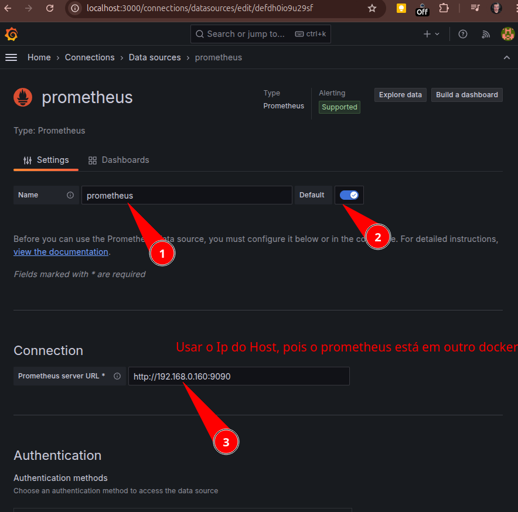


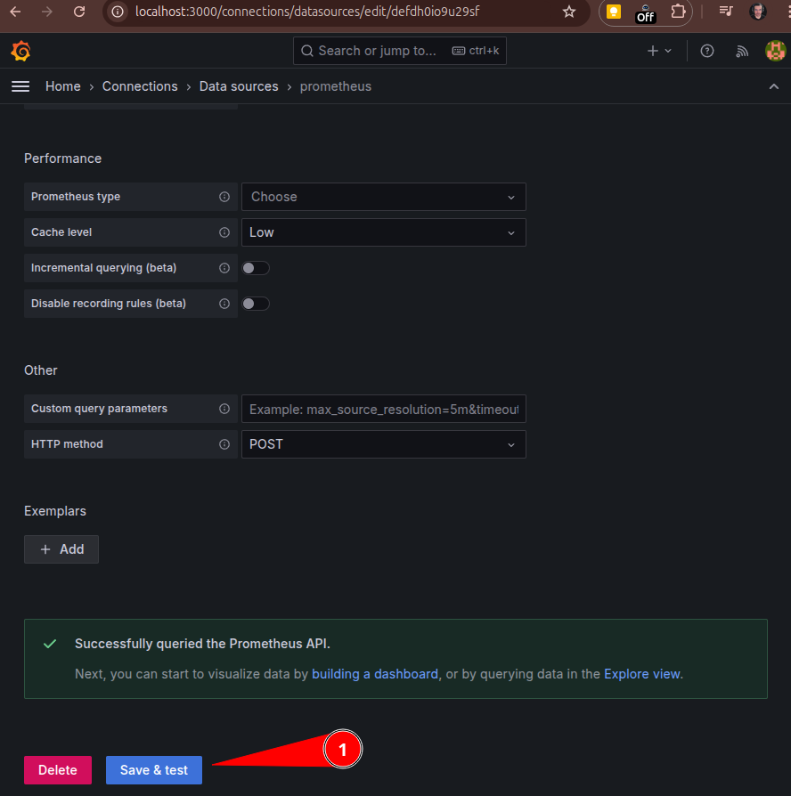

Só escolher o tipo de dados:

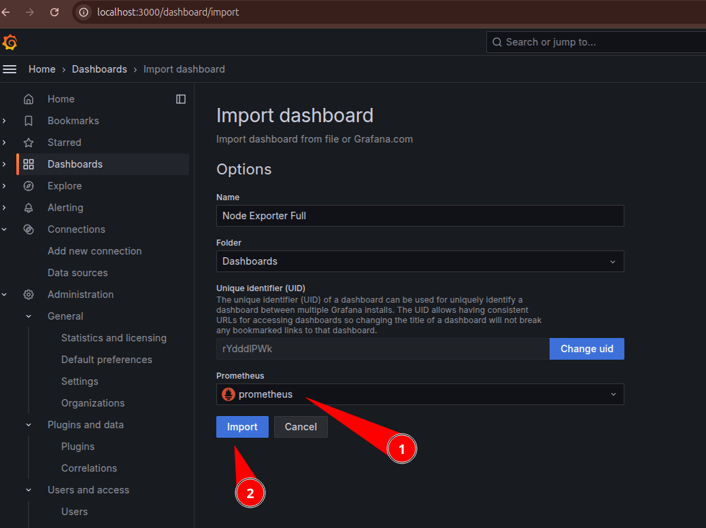

O dashboard importado:

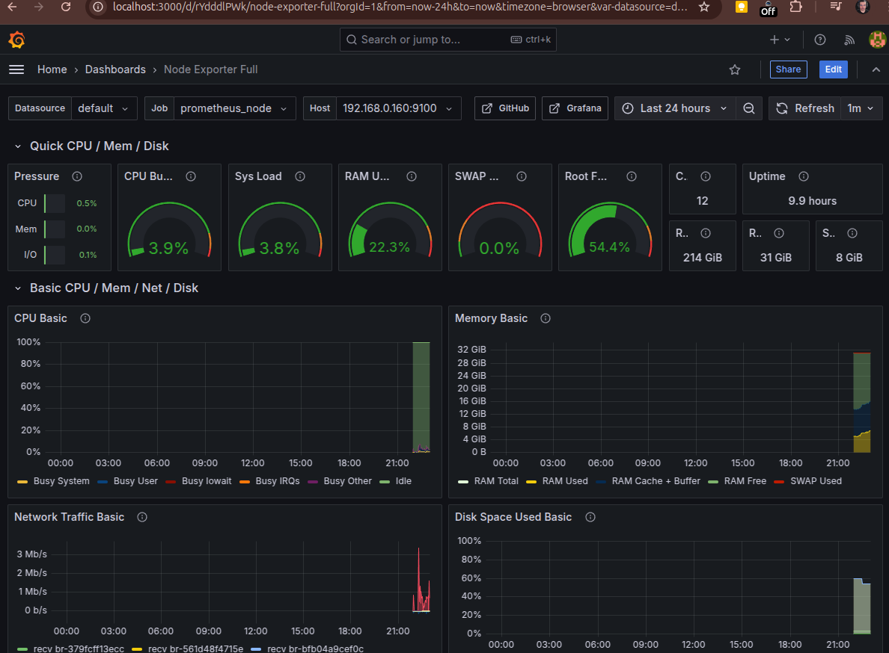

### Teste de stress

Para validar consumo dos dados via agente.

Instale:

```shell
sudo apt-get install epel-release
sudo apt-get install stress
```

Execute e veja no dashboard do grafana:

```shell
sudo stress --cpu 12 --io 8 --vm 4 --vm-bytes 1G --timeout 30s
```

O resultado:

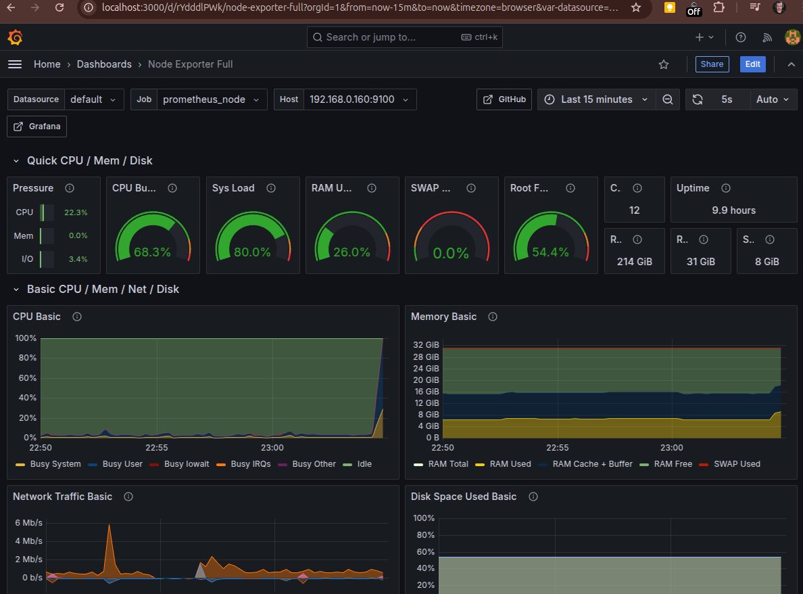